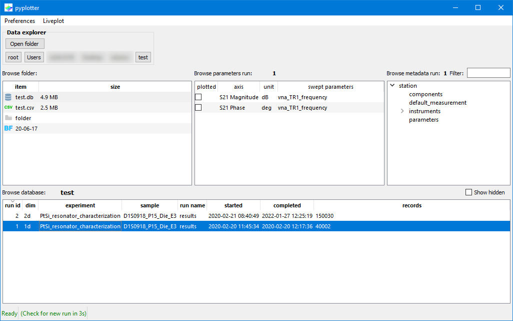

# Plotter

A data browser and vizualizer for QCoDes database and BlueFors logging files.

## Installation

The easiest way is to clone the repository

```bash
git clone https://codev-tuleap.intra.cea.fr/plugins/git/qusi/plotter
```

You need QCodes to be installed and also the following libraries:

```bash
conda install pyqtgraph pandas matplotlib pyopengl
pip install lmfit
```

## Getting Started

Before launching the software, open the config.py file located in `plotter/sources/config.py`. You should see the wollowing lines:

```python
'root' : 'S:/132-PHELIQS/132.05-LATEQS/132.05.01-QuantumSilicon',
'path' : 'S:/132-PHELIQS/132.05-LATEQS/132.05.01-QuantumSilicon',
```

Theses lines are used as default path. However it could happen that the data server is not mount on the S disk of your computer. If so, modify these lines so that it matches your current network.

Once this is done, open a conda terminal and go to the repository folder. Then simply launch the plotter.py file to launch the software:

```bash
python plotter.py
```

## Use

> **To open folders, databases, ... : use one click, no double click**

Once the software is launched, you access the main window:



The top left corner allows you to browse the dataserver and reached your database file, the bottom left corner displays the runs saved in your database, the top right shows the dependent parameters saved during your runs and the bottom right the meta-data associated with a run.
Once you have find your database and run and have clicked on it, you get this window:


To plot your data you check the available checkbox and get a 1D plot window


or a 2D one


Plot windows allow live interaction.


## Authors

* **Etienne Dumur**  etienne.dumur@gmail.com

## License

Surely free but I have to chose one.