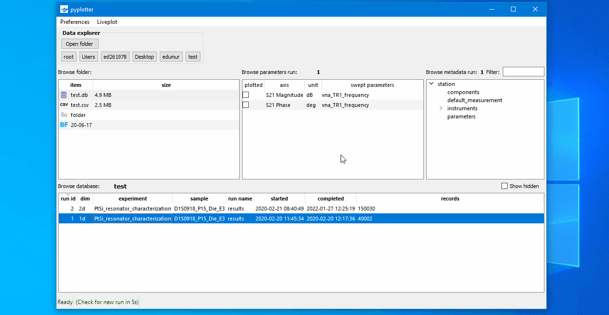
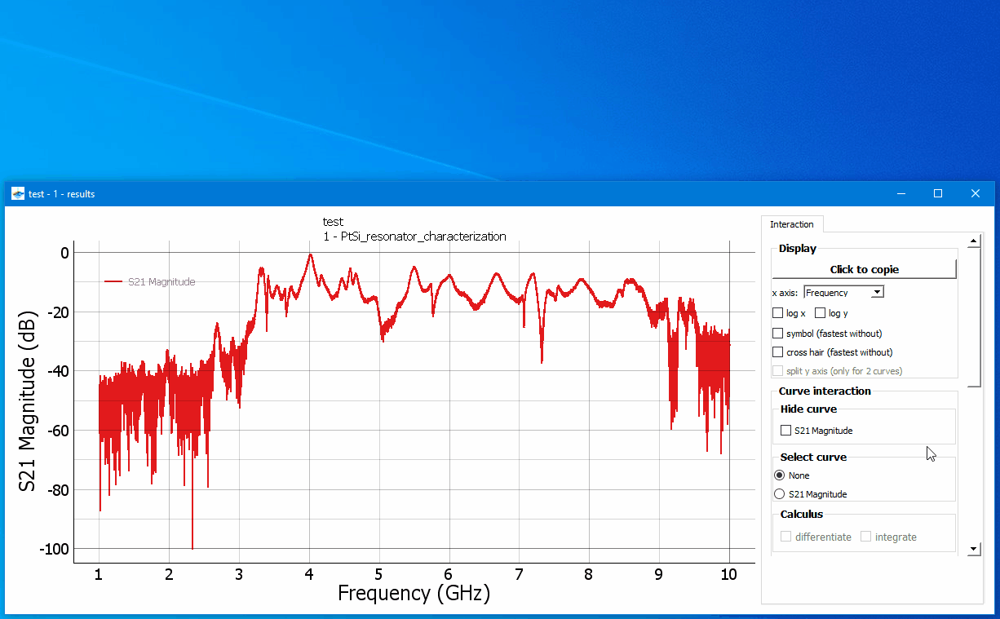
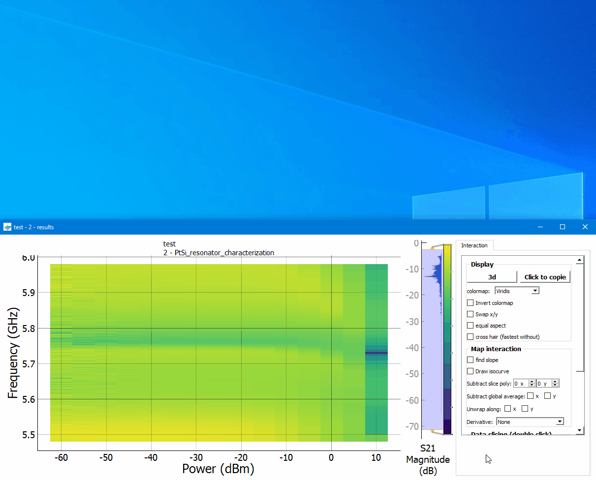
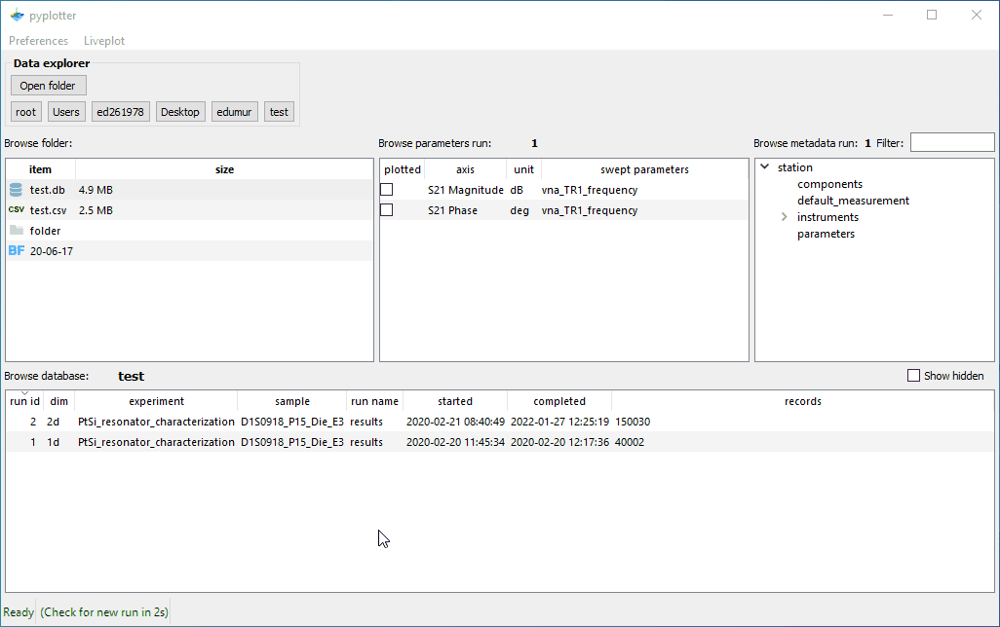
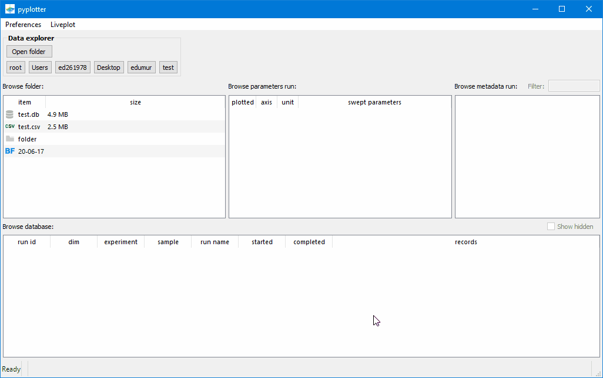

# pyplotter

A data browser and vizualizer for QCoDes database, csv, s2p and BlueFors logging files. The purpose of the plotter is to make data exploration as simple and fast as possible. You should never waste time to plot some raw, do some simple fit, ... and that's why the plotter do it for you.


## Getting Started

### Installation

The easiest way is to clone the repository where you want to download the plotter.

```bash
git clone https://github.com/pyplotter/pyplotter
cd pyplotter
pip install -e .
```

Before launching the software, open the `config` file located in `pyplotter/sources/config.py`. You should see the wollowing lines:

```python
'root' : 'C:/',
'path' : 'C:/',
```

Theses lines are used as default path. You may however chose another default path corresponding to your local situation. If so, modify these lines so that it matches your current network. When it is done, it is important to commit locally these changes to avoid to lose them when updating the plotter.

```bash
git commit sources/config.py
```

Congrats, the plotter is ready to be used.
To launch the plotter, open an anaconda powershell and type

```bash
pyplotter
```

## Use

### Tip

* To open folders, databases, ... : use one click, no double click

### Main window

Once the software is launched, you access the main window shown below


1. Display your current path. The root correspond to the `root` configuration key set during the installation. You can go above the root in your folder tree. To open another folder a button is available. It will modify your `root` and `path` key for the time you used the plotter. Every opened folder will be shown here as a chain and will allow you to come back to higher folder quickly by clicking on them.
2. The file explorer. It displays only files that the plotter handles, in this example "csv" and "s2p" files are shown. You can click on folders to open them. To make navigation faster, you can add interesting folders in the `enhancedFolder` key of the config file. Folders having one these names will appear differently, here there are shown in blue.
3. Will display runs information when a QCoDeS database is cliked on.
4. Status bar, display information about the GUI.
5. When a QCoDeS database is selected, a livemode can be activated by checking the box.
6. Display information about a selected run.
7. Display information available for QCoDeS runs and "s2p" files.

When you select a QCoDeS database and a run, you will fill panel 4, 6 and 6 as shown below


### 1d plot

To plot your data, check the dependent parameter you want to plot



You can plot as many dependent parameters as you want from the same run, see below


#### 1d plot interactions

Many interactions with your curves are available.

For example the filter interaction.
First you select the curve you want to interact with on the "Select curve" group box.
Second you select the data you want to use for the interaction and then you click on the interaction you want, here "Savitsky-Golay".



### 2d plot

To plot your data, check the dependent parameter you want to plot


#### 2d plot interactions

Once a 2d plot is launched you can make slices of your data and launched 1d plot linked to your 2d plot.
The linked 1d plot posses the standard interactivity of a 1d plot.



### Staring and hiding your run

The plotter allos the user to star or hide a run.
To do so simply press "s" and "h" when you have selected a run.
A star runs will then appear with a star while a hidden run will no be visible per default but will require the user to click on "Show hidden".
This offers an easy way to hide "faulty" run and note "good" run but it doesn't replace a good old labbook.

### Find a parameter in QCoDeS metadata

QCoDeS metadata consists of saving *everything* and while this is nice it makes the recovery of information quite delicate.
In order to make this smoother the plotter allows the user to filter the visible metada by typing in the filter text field



### Live plot mode

The plotter can also plot data during acquisition by using the livePlot check box.
Simply choose a QCoDeS database and click on livePlot and any new run will be displayed as a standard 1d or 2d plot.



### Compare data from different run

The plotter offers a way to compare any data already plotted in a 1d plot window.
When at least two curves are plotted, an "Add curves" tab will appear allowing user to compare curves from different runs.


## Known issues

### Read data taken by a newer QCoDeS version

QCoDeS ensures backward but not forward compatibility for the data which means that a database taken by a version "i" de QCoDeS can be read by another version "j" of QCoDeS only if "j>i".
Otherwise the plotter will most likely have error like the following one:
```bash
Traceback (most recent call last):
  File "...\pyplotter\pyplotter\sources\loaddata.py", line 89, in run
    d = self.getParameterData(self.runId, paramsDependent['name'], self.signals.updateProgressBar, self.progressBarKey)
  File "...\pyplotter\pyplotter\sources\qcodesdatabase.py", line 743, in getParameterData
    ds =  load_by_id(run_id=int(runId), conn=conn)
  File "...\Anaconda3\envs\python37\lib\site-packages\qcodes\dataset\data_set.py", line 1228, in load_by_id
    d = DataSet(conn=conn, run_id=run_id)
  File "...\Anaconda3\envs\python37\lib\site-packages\qcodes\dataset\data_set.py", line 295, in __init__
    run_desc = self._get_run_description_from_db()
  File "...\Anaconda3\envs\python37\lib\site-packages\qcodes\dataset\data_set.py", line 559, in _get_run_description_from_db
    return serial.from_json_to_current(desc_str)
  File "...\Anaconda3\envs\python37\lib\site-packages\qcodes\dataset\descriptions\versioning\serialization.py", line 115, in from_json_to_current
    return from_dict_to_current(json.loads(json_str))
  File "...\Anaconda3\envs\python37\lib\site-packages\qcodes\dataset\descriptions\versioning\serialization.py", line 70, in from_dict_to_current
    desc = from_dict_to_native(dct)
  File "...\Anaconda3\envs\python37\lib\site-packages\qcodes\dataset\descriptions\versioning\serialization.py", line 63, in from_dict_to_native
    return run_describers[dct['version']]._from_dict(dct)
KeyError: 2
```

To solve the issue, just update your QCoDeS verion:
```bash
pip install --upgrade qcodes
```

## Authors

* **Etienne Dumur** -*main developer*- etienne.dumur@gmail.com

## License

MIT

## Acknowledgments

* [plottr](https://github.com/toolsforexperiments/plottr), for the inspiration of some interfaces.
* [pyqtgraph](http://www.pyqtgraph.org/), for the amazing and **fast** plotting library.
* [bokeh](https://github.com/bokeh/bokeh/blob/7cc500601cdb688c4b6b2153704097f3345dd91c/bokeh/palettes.py), for their work on the colormap palette reused here.
* [qb style](https://github.com/quantumblacklabs/qbstyles), for its color codes of lines.
