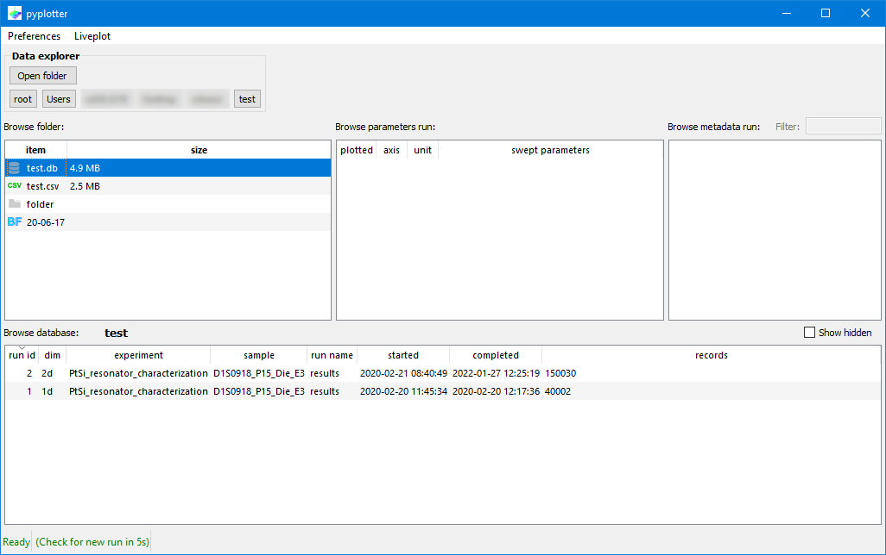

# Plotter

A data browser and vizualizer for QCoDes database.


## Getting Started

Before launching the software, open the config.py file. You should see the wollowing lines:

```python
'root' : 'S:/132-PHELIQS/132.05-LATEQS/132.05.01-QuantumSilicon',
'path' : 'S:/132-PHELIQS/132.05-LATEQS/132.05.01-QuantumSilicon',
```

Theses lines are used as default path. However it could happen that the data server is not mount on the S disk of your computer. If so, modify these lines so that it matches your current network.

Once this is done, open a conda terminal and go to the repository folder. Then simply launch the plotter.py file to launch the software:

```
python plotter.py
```

Once the software is launched, you access the main window:


The top left corner allows you to browse the dataserver and reached your database file, the bottom left corner displays the runs saved in your database, the top right shows the dependent parameters saved during your runs and the bottom right the meta-data associated with a run.
Once you have find your database and run and have clicked on it, you get this window:



To plot your data you check the available checkbox and get a 1D plot window


or a 2D one


Plot windows allow live interaction.


## Installing

The easiest way is to clone the repository

```
git clone https://gitlab.com/edumur/plotter
```

You need QCodes to be installed and also the following libraries:

```
conda install pyqtgraph pandas matplotlib lmfit pyopengl
```

## Authors

* **Etienne Dumur**  etienne.dumur@gmail.com

## TODO

* Add plotting capability of BluFors log file (temperature and pression)
* Add plotting capability of s2p file, or ascci file of VNA
* Add 3d plots
* Add metadata display
* Add posibility to compare 1d plot of different run
* Implement none blocking liveplot mode
* Chose licence

## License

Surely free but I have to chose one.